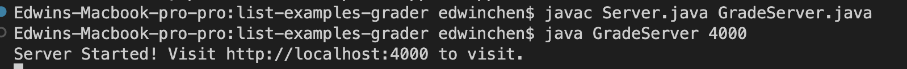
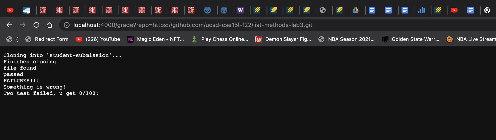
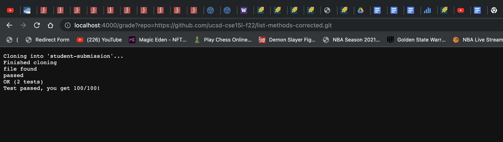
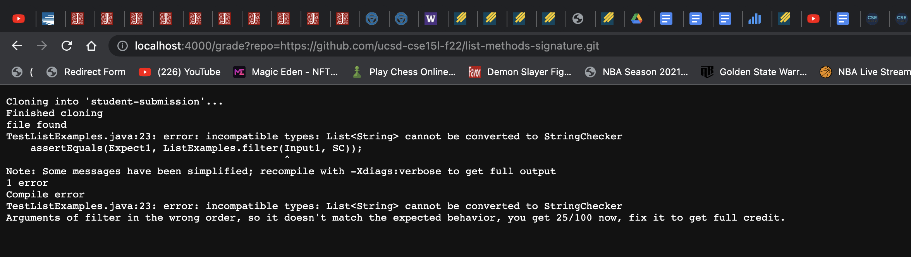

# Lab Report 5

Grade.sh code:
```
# Create your grading script here

rm -rf student-submission
git clone $1 student-submission
echo 'Finished cloning'
cp TestListExamples.java student-submission/
cp -r lib student-submission/
cd student-submission

if [[ -e ListExamples.java ]]
then 
    echo "file found"
else 
    echo "file not found"
    exit 1
fi 

javac -cp .:lib/hamcrest-core-1.3.jar:lib/junit-4.13.2.jar *.java &> Compile.txt 

if [ $? -eq 0 ]
then 
    echo "passed"
    java -cp .:lib/hamcrest-core-1.3.jar:lib/junit-4.13.2.jar org.junit.runner 
    JUnitCore TestListExamples &> Result.txt

    if grep "OK" Result.txt
    then 
        echo "Test passed, you get 100/100!"
    fi

    if grep "FAILURES" Result.txt
    then 
        echo "Something is wrong!"
        if grep "Failures: 1" Result.txt
        then
            echo "One test failed, you get 50/100!"
        else
            echo "Two test failed, you get 0/100!"
        fi
    fi

else
    cat compile.txt
    echo "Compile error"
    if grep "';' expected" Compile.txt
    then
        echo "Fix it and come back again, you get 50/100 now."
        exit 1
        fi
    if grep "cannot be converted to StringChecker" Compile.txt
    then
        echo "Arguments of filter in the wrong order, so it doesn't match the expected behavior, you get 25/100 now, fix it to get full credit."
        fi

fi
```
# Screenshot of three different student submissions and their reported grade as loaded in the browser

Run on the local server:<br>

Student Submission1:<br>
Github link: https://github.com/ucsd-cse15l-f22/list-methods-lab3.git <br>

Screenshot:<br>


Student Submission2:<br>
Github link: https://github.com/ucsd-cse15l-f22/list-methods-corrected.git <br>

Screenshot:<br>


Student Submission3:<br>

Github link: https://github.com/ucsd-cse15l-f22/list-methods-signature.git <br>

Screenshot:<br>


# Trace the script and explain what grade.sh do in the example

The example will be:<br>
Student Submission1:<br>

Github link: https://github.com/ucsd-cse15l-f22/list-methods-lab3.git <br>

Screenshot:<br>


Explanation:
First:
``` 
Cloning into 'student-submission'...
Finished cloning
``` 
is from line 4 and line 5 of the grade.sh and it returns the standard output.

Second:
```
file found
```
is from line 12, and it returns the standard output. The return code was not 0.

Third:
```
passed
```
is from line 22, and it returns the standard output.

Fourth:
```
FAILURES!!!
```
This is from line 23, and it returns the result from Junit.

Fifth:
```
Something is wrong!
```
This is from line 32, and it returns the standard output.

Sixth:
```
Two test failed, you get 0/100!
```
This is from line 37, and it returns the standard output.

The if statement:
line 10
```
if [[ -e ListExamples.java ]]
```
 is true, because the file was found. (second cammand)<br>
line 20 
```
if [ $? -eq 0 ]
```
is true, because the file passed. (Third command)<br>
line 25
```
if grep "OK" Result.txt
```
 is false, because in Junit it didn't have "OK", and it passed down to the next if statement.<br>

line 30
```
if grep "FAILURES" Result.txt
```
 is true, because in Junit it has "FAILURES".<br>

line 33
```
if grep "Failures: 1" Result.txt
```
 is false, because both test failed.

The line that did not run:
From line 40-54 the line did not run.
Because the problem of student submission 1 is that the student did not change the code, but there was no compile error, thus it won't go into the else statement on line 41. Also it read the "FAILURES" from Junit do it will execute the line 30-39 and stop there.
